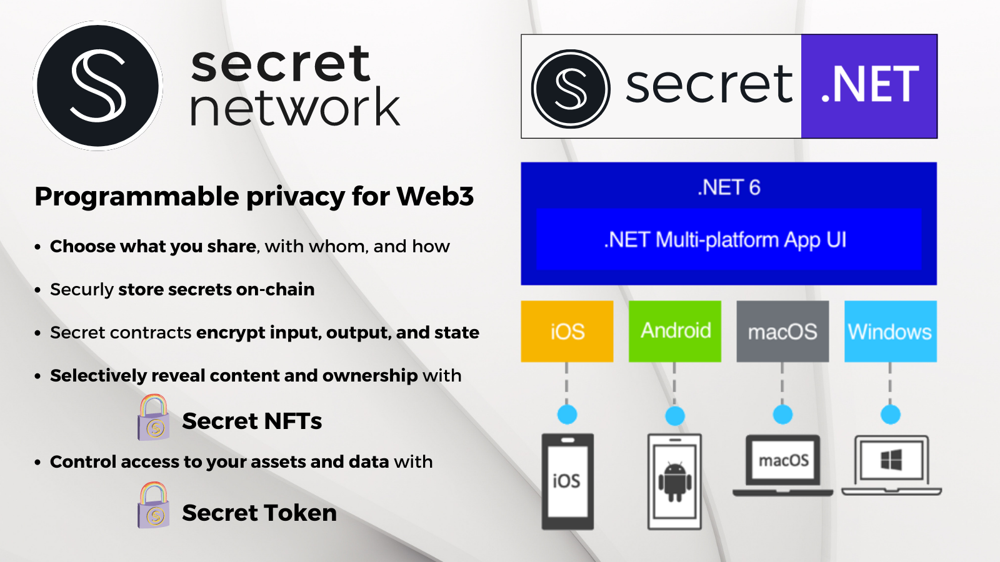
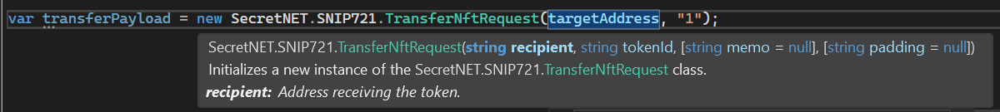

# Secret.NET NFT (SNIP721) / Secret NFT
**Secret.NET NFT** is a layer on top of the [**Secret.NET client**](https://github.com/0xxCodemonkey/SecretNET) which supports all methods of the reference implementation of the SNIP721 contract.

**The [Secret Network blockchain](https://scrt.network/) (L1 / Cosmos), is the first privacy smart contract blockchain that processes and stores data on-chain in encrypted form (via Intel SGX).** 
This allows [unique use cases](https://docs.scrt.network/secret-network-documentation/secret-network-overview/use-cases) like **Secret NFTs** where you can store public and private data e.g., Encryption Keys, passwords or other secrets.

<p align="center">
  
</p>

**SecretNET.NFT** provides typed and documented objects and methods that simplify interaction with a SNIP721 smart contract.

- Implementation => [GitHub - baedrik/snip721-reference-impl](https://github.com/baedrik/snip721-reference-impl) 
- Implementation of the [SNIP-721 specification](https://github.com/SecretFoundation/SNIPs/blob/master/SNIP-721.md) and [SNIP-722 specification](https://github.com/baedrik/snip-722-spec/blob/master/SNIP-722.md).
- See also the [SNIP721 documentation on Secret Network](https://docs.scrt.network/secret-network-documentation/development/snips/snip-721-private-non-fungible-tokens-nfts).

:white_check_mark: **This repository is explicitly intended to serve as a template for custom SNIP721 NFT contracts.**
This makes it easy to create your own customized clients for your own customized contracts.
Of course, the concept can be used for any kind of smart contracts in general.

## Full API-documentation
You can find the **full API-documentation** here => https://0xxcodemonkey.github.io/SecretNET.NFT

# Table of Contents
- [Implementation](#implementation)
  - [Instantiating a SNIP721 Client](#instantiating-a-snip721-client)
  - [Usage](#usage)
- [Implemented methods](#implemented-methods)
  - [Queries](#queries-snip721clientquery)
  - [Transactions](#transactions-snip721clienttx)

# Implementation
The structure of **SecretNET.NFT** is the same as the **SecretNET** client and transactions are accessible via `Tx` property and queries via `Query` property.

All transactions can also be simulated via `Tx.Simulate`.

**All types and methods are documented and eases programming:**


## Instantiating a SNIP721 Client
To instantiate a **SecretNET.SNIP721** client you just have to pass it a [SecretNET client instance](https://github.com/0xxCodemonkey/SecretNET#usage-examples):
```  csharp
var snip721Client =  new SecretNET.NFT.Snip721Client(secretNetworkClient);
```

## Usage
All Methods can be easily called with the payload message like this:
```  csharp
var payloadTransferMsg = new SecretNET.NFT.TransferNftRequest(
              recipientAddress,
              tokenId);
              
var transferMsg = new SecretNET.NFT.MsgTransferNft(
                payloadTransferMsg, 
                snip721ContractAddress, 
                snip721CodeHash);

var transferResult = await snip721Client.Tx.TransferNft(
                transferMsg, 
                txOptions: txOptionsExecute);
```

Many methods also have an overload to make them even easier to call, like this
```  csharp
var transferResult = await snip721Client.Tx.TransferNft(
                snip721ContractAddress, 
                recipientAddress, 
                tokenId, 
                codeHash: snip721CodeHash, 
                txOptions: txOptionsExecute);
```

# Implemented methods
- [Queries](#queries-snip721clientquery)
  - [GetAllNftInfo](#getallnftinfo)
  - [GetAllTokens](#getalltokens)
  - [GetApprovedForAll](#getapprovedforall)
  - [GetBatchNftDossier](#getbatchnftdossier)
  - [GetContractConfig](#getcontractconfig)
  - [GetContractInfo](#gettokeninfo)
  - [GetImplementsNonTransferableTokens](#getimplementsnontransferabletokens)
  - [GetImplementsTokenSubtype](#getimplementstokensubtype)
  - [GetInventoryApprovals](#getinventoryapprovals)
  - [GetIsTransferable](#getistransferable)
  - [GetIsUnwrapped](#getisunwrapped)
  - [GetMinters](#getminters)
  - [GetNftDossier](#getnftdossier)
  - [GetNftInfo](#getnftinfo)
  - [GetNumTokens](#getnumtokens)
  - [GetNumTokensOfOwner](#getnumtokensofowner)
  - [GetOwnerOf](#getownerof)
  - [GetPrivateMetadata](#getprivatemetadata)
  - [GetRegisteredCodeHash](#getregisteredcodehash)
  - [GetRoyaltyInfo](#getroyaltyinfo)
  - [GetTokenApprovals](#gettokenapprovals)
  - [GetTokens](#gettokens)
  - [GetTransactionHistory](#gettransactionhistory)
  - [GetVerifyTransferApproval](#getverifytransferapproval)
- [Transactions](#transactions-snip721clienttx)
  - [AddMinter](#addminter)
  - [Approve](#approve)
  - [ApproveAll](#approveall)
  - [BatchBurnNft](#batchburnnft)
  - [BatchMintNft](#batchmintnft)
  - [BatchSendNft](#batchsendnft)
  - [BatchTransferNft](#batchtransfernft)
  - [BurnNft](#burnnft)
  - [ChangeAdmin](#changeadmin)
  - [CreateViewingKey](#createviewingkey)
  - [Instantiate (new contract)](#instantiate-new-contract)
  - [MakeOwnershipPrivate](#makeownershipprivate)
  - [MintNft](#mintnft)
  - [MintNftClones](#mintnftclones)
  - [RegisterReceiveNft](#registerreceivenft)
  - [RemoveMinters](#removeminters)
  - [Reveal](#reveal)
  - [Revoke](#revoke)
  - [RevokeAll](#revokeall)
  - [RevokePermit](#revokepermit)
  - [SendNft](#sendnft)
  - [SetContractStatus](#setcontractstatus)
  - [SetGlobalApproval](#setglobalapproval)
  - [SetMetadata](#setmetadata)
  - [SetMinters](#setminters)
  - [SetRoyaltyInfo](#setroyaltyinfo)
  - [SetViewingKey](#setviewingkey)
  - [SetWhitelistedApproval](#setwhitelistedapproval)
  - [TransferNft](#transfernft)
  
## Queries (`Snip721Client.Query`)
### [GetAllNftInfo](https://0xxcodemonkey.github.io/SecretNET.NFT/html/M-SecretNET.NFT.Snip721Querier.GetAllNftInfo.htm)
AllNftInfo displays the result of both OwnerOf and NftInfo in a single query. This is provided for CW-721 compliance, but for more complete information about a token, use NftDossier, which will include private metadata and view_owner and view_private_metadata approvals if the querier is permitted to view this information.
``` csharp
GetAllNftInfo(
	string contractAddress,
	string tokenId,
	ViewerInfo viewerInfo,
	Nullable<Permit> permit,
	Nullable<bool> includeExpired,
	Nullable<string> codeHash
);
```
### [GetAllTokens](https://0xxcodemonkey.github.io/SecretNET.NFT/html/M-SecretNET.NFT.Snip721Querier.GetAllTokens.htm)
AllTokens returns an optionally paginated list of all the token IDs controlled by the contract. If the contract's token supply is private, only an authenticated minter's address will be allowed to perform this query. When paginating, supply the last token ID received in a response as the start_after token ID of the next query to continue listing where the previous query stopped.
``` csharp
GetAllTokens(
	string contractAddress,
	string address,
	string viewingKey,
	Nullable<Permit> permit,
	string startAfter,
	Nullable<int> limit,
	Nullable<string> codeHash
);
```
### [GetApprovedForAll](https://0xxcodemonkey.github.io/SecretNET.NFT/html/M-SecretNET.NFT.Snip721Querier.GetApprovedForAll.htm)
ApprovedForAll displays all the addresses that have approval to transfer all of the specified owner's tokens. This is provided to comply with CW-721 specification, but because approvals are private on Secret Network, if the owner's viewing key is not provided, no approvals will be displayed. For a more complete list of inventory-wide approvals, the owner should use InventoryApprovals which also includes view_owner and view_private_metadata approvals.
``` csharp
GetApprovedForAll(
	string contractAddress,
	string tokenId,
	string viewingKey,
	Nullable<Permit> permit,
	Nullable<bool> includeExpired,
	Nullable<string> codeHash
)
```
### [GetBatchNftDossier](https://0xxcodemonkey.github.io/SecretNET.NFT/html/M-SecretNET.NFT.Snip721Querier.GetBatchNftDossier.htm)
Displays all the information about multiple tokens that the viewer has permission to see. This may include the owner, the public metadata, the private metadata, royalty information, mint run information, whether the token is unwrapped, whether the token is transferable, and the token and inventory approvals.
``` csharp
GetBatchNftDossier(
	string contractAddress,
	string[] tokenIds,
	ViewerInfo viewerInfo,
	Nullable<Permit> permit,
	Nullable<bool> includeExpired,
	Nullable<string> codeHash
);
```
### [GetContractConfig](https://0xxcodemonkey.github.io/SecretNET.NFT/html/M-SecretNET.NFT.Snip721Querier.GetContractConfig.htm)
ContractConfig returns the configuration values that were selected when the contract was instantiated. See Config for an explanation of the configuration options. This query is not authenticated.
``` csharp
GetContractConfig(
	string contractAddress,
	Nullable<string> codeHash
);
```
### [GetContractInfo](https://0xxcodemonkey.github.io/SecretNET.NFT/html/M-SecretNET.NFT.Snip721Querier.GetContractInfo.htm)
ContractInfo returns the contract's name and symbol. This query is not authenticated.
``` csharp
GetContractInfo(
	string contractAddress,
	Nullable<string> codeHash
);
```
### [GetImplementsNonTransferableTokens](https://0xxcodemonkey.github.io/SecretNET.NFT/html/M-SecretNET.NFT.Snip721Querier.GetImplementsNonTransferableTokens.htm)
ImplementsNonTransferableTokens is a SNIP-722 query which indicates whether the contract implements non-transferable tokens. Because legacy SNIP-721 contracts do not implement this query and do not implement non-transferable tokens, any use of this query should always check for an error response, and if the response is an error, it can be considered that the contract does not implement non-transferable tokens. Because message parsing ignores input fields that a contract does not expect, this query should be used before attempting to mint a non-transferable token. If the message is sent to a SNIP-721 contract that does not implement non-transferable tokens, the transferable field will just be ignored and the resulting NFT will still be created, but will always be transferable.
``` csharp
GetImplementsNonTransferableTokens(
	string contractAddress,
	Nullable<string> codeHash
);
```
### [GetImplementsTokenSubtype](https://0xxcodemonkey.github.io/SecretNET.NFT/html/M-SecretNET.NFT.Snip721Querier.GetImplementsTokenSubtype.htm)
ImplementsTokenSubtype is a SNIP-722 query which indicates whether the contract implements the token_subtype Extension field. Because legacy SNIP-721 contracts do not implement this query and do not implement token subtypes, any use of this query should always check for an error response, and if the response is an error, it can be considered that the contract does not implement subtypes. Because message parsing ignores input fields that a contract does not expect, this query should be used before attempting a message that uses the token_subtype Extension field. If the message is sent to a SNIP-721 contract that does not implement token_subtype, that field will just be ignored and the resulting NFT will still be created/updated, but without a token_subtype.
``` csharp
GetImplementsTokenSubtype(
	string contractAddress,
	Nullable<string> codeHash
);
```
### [GetInventoryApprovals](https://0xxcodemonkey.github.io/SecretNET.NFT/html/M-SecretNET.NFT.Snip721Querier.GetInventoryApprovals.htm)
InventoryApprovals returns whether all the address' tokens have public ownership and/or public display of private metadata, and lists all the inventory-wide approvals the address has granted. Only the viewing key for this specified address will be accepted. (This query MUST be authenticated)
``` csharp
GetInventoryApprovals(
	string contractAddress,
	string tokenId,
	string viewingKey,
	Nullable<Permit> permit,
	Nullable<bool> includeExpired,
	Nullable<string> codeHash
);
```
### [GetIsTransferable](https://0xxcodemonkey.github.io/SecretNET.NFT/html/M-SecretNET.NFT.Snip721Querier.GetIsTransferable.htm)
IsTransferable is a SNIP-722 query that indicates whether the token is transferable. This query is not authenticated.
``` csharp
GetIsTransferable(
	string contractAddress,
	string tokenId,
	Nullable<string> codeHash
);
```
### [GetIsUnwrapped](https://0xxcodemonkey.github.io/SecretNET.NFT/html/M-SecretNET.NFT.Snip721Querier.GetIsUnwrapped.htm)
IsUnwrapped indicates whether the token has been unwrapped. If sealed metadata is not enabled, all tokens are considered to be unwrapped. This query is not authenticated.
``` csharp
GetIsUnwrapped(
	string contractAddress,
	string tokenId,
	Nullable<string> codeHash
);
```
### [GetMinters](https://0xxcodemonkey.github.io/SecretNET.NFT/html/M-SecretNET.NFT.Snip721Querier.GetMinters.htm)
Minters returns the list of addresses that are authorized to mint tokens. This query is not authenticated.
``` csharp
GetMinters(
	string contractAddress,
	Nullable<string> codeHash
);
```
### [GetNftDossier](https://0xxcodemonkey.github.io/SecretNET.NFT/html/M-SecretNET.NFT.Snip721Querier.GetNftDossier.htm)
NftDossier returns all the information about a token that the viewer is permitted to view. If no viewer is provided, NftDossier will only display the information that has been made public. The response may include the owner, the public metadata, the private metadata, the reason the private metadata is not viewable, the royalty information, the mint run information, whether the token is transferable, whether ownership is public, whether the private metadata is public, and (if the querier is the owner,) the approvals for this token as well as the inventory-wide approvals for the owner. This implementation will only display a token's royalty recipient addresses if the querier has permission to transfer the token. SNIP-722 adds a transferable field to the NftDossier response. SNIP-723 (specification to be written) adds an unwrapped field which is false if private metadata for this token is sealed.
``` csharp
GetNftDossier(
	string contractAddress,
	string tokenId,
	ViewerInfo viewerInfo,
	Nullable<Permit> permit,
	Nullable<bool> includeExpired,
	Nullable<string> codeHash
);
```
### [GetNftInfo](https://0xxcodemonkey.github.io/SecretNET.NFT/html/M-SecretNET.NFT.Snip721Querier.GetNftInfo.htm)
NftInfo returns the public metadata of a token. It follows CW-721 specification, which is based on ERC-721 Metadata JSON Schema. At most, one of the fields token_uri OR extension will be defined.
``` csharp
GetNftInfo(
	string contractAddress,
	string tokenId,
	Nullable<string> codeHash
);
```
### [GetNumTokens](https://0xxcodemonkey.github.io/SecretNET.NFT/html/M-SecretNET.NFT.Snip721Querier.GetNumTokens.htm)
NumTokens returns the number of tokens controlled by the contract. If the contract's token supply is private, only an authenticated minter's address will be allowed to perform this query.
``` csharp
GetNumTokens(
	string contractAddress,
	string address,
	string viewingKey,
	Nullable<Permit> permit,
	Nullable<string> codeHash
);
```
### [GetNumTokensOfOwner](https://0xxcodemonkey.github.io/SecretNET.NFT/html/M-SecretNET.NFT.Snip721Querier.GetNumTokensOfOwner.htm)
Displays the number of tokens that the querier has permission to see the owner and that belong to the specified address.
``` csharp
GetNumTokensOfOwner(
	string contractAddress,
	string owner,
	string viewer,
	string viewingKey,
	Nullable<Permit> permit,
	Nullable<string> codeHash
);
```
### [GetOwnerOf](https://0xxcodemonkey.github.io/SecretNET.NFT/html/M-SecretNET.NFT.Snip721Querier.GetOwnerOf.htm)
OwnerOf returns the owner of the specified token if the querier is the owner or has been granted permission to view the owner. If the querier is the owner, OwnerOf will also display all the addresses that have been given transfer permission. The transfer approval list is provided as part of CW-721 compliance; however, the token owner is advised to use NftDossier for a more complete list that includes view_owner and view_private_metadata approvals (which CW-721 is not capable of keeping private). If no viewer is provided, OwnerOf will only display the owner if ownership is public for this token.
``` csharp
GetOwnerOf(
	string contractAddress,
	string tokenId,
	ViewerInfo viewerInfo,
	Nullable<Permit> permit,
	Nullable<bool> includeExpired,
	Nullable<string> codeHash
);
```
### [GetPrivateMetadata](https://0xxcodemonkey.github.io/SecretNET.NFT/html/M-SecretNET.NFT.Snip721Querier.GetPrivateMetadata.htm)
PrivateMetadata returns the private metadata of a token if the querier is permitted to view it. It follows CW-721 metadata specification, which is based on ERC-721 Metadata JSON Schema. At most, one of the fields token_uri OR extension will be defined. If the metadata is sealed, no one is permitted to view it until it has been unwrapped with Reveal. If no viewer is provided, PrivateMetadata will only display the private metadata if the private metadata is public for this token.
``` csharp
GetPrivateMetadata(
	string contractAddress,
	string tokenId,
	ViewerInfo viewerInfo,
	Nullable<Permit> permit,
	Nullable<string> codeHash
);
```
### [GetRegisteredCodeHash](https://0xxcodemonkey.github.io/SecretNET.NFT/html/M-SecretNET.NFT.Snip721Querier.GetRegisteredCodeHash.htm)
RegisteredCodeHash will display the code hash of the specified contract if it has registered its receiver interface and will indicate whether the contract implements BatchReceiveNft.
``` csharp
GetRegisteredCodeHash(
	string contractAddress,
	Nullable<string> codeHash
);
```
### [GetRoyaltyInfo](https://0xxcodemonkey.github.io/SecretNET.NFT/html/M-SecretNET.NFT.Snip721Querier.GetRoyaltyInfo.htm)
If a token_id is provided in the request, RoyaltyInfo returns the royalty information for that token. This implementation will only display a token's royalty recipient addresses if the querier has permission to transfer the token. If no token_id is requested, RoyaltyInfo displays the default royalty information for the contract. This implementation will only display the contract's default royalty recipient addresses if the querier is an authorized minter.
``` csharp
GetRoyaltyInfo(
	string contractAddress,
	string tokenId,
	ViewerInfo viewerInfo,
	Nullable<Permit> permit,
	Nullable<string> codeHash
);
```
### [GetTokenApprovals](https://0xxcodemonkey.github.io/SecretNET.NFT/html/M-SecretNET.NFT.Snip721Querier.GetTokenApprovals.htm)
TokenApprovals returns whether the owner and private metadata of a token is public, and lists all the approvals specific to this token. Only the token's owner may perform TokenApprovals. (This query MUST be authenticated)
``` csharp
GetTokenApprovals(
	string contractAddress,
	string tokenId,
	string viewingKey,
	Nullable<Permit> permit,
	Nullable<bool> includeExpired,
	Nullable<string> codeHash
);
```
### [GetTokens](https://0xxcodemonkey.github.io/SecretNET.NFT/html/M-SecretNET.NFT.Snip721Querier.GetTokens.htm)
Tokens displays an optionally paginated list of all the token IDs that belong to the specified owner. It will only display the owner's tokens on which the querier has view_owner permission. If no viewing key is provided, it will only display the owner's tokens that have public ownership. When paginating, supply the last token ID received in a response as the start_after string of the next query to continue listing where the previous query stopped.
``` csharp
GetTokens(
	string contractAddress,
	string owner,
	string viewer,
	string viewingKey,
	Nullable<Permit> permit,
	string startAfter,
	Nullable<int> limit,
	Nullable<string> codeHash
);
```
### [GetTransactionHistory](https://0xxcodemonkey.github.io/SecretNET.NFT/html/M-SecretNET.NFT.Snip721Querier.GetTransactionHistory.htm)
TransactionHistory displays an optionally paginated list of transactions (mint, burn, and transfer) in reverse chronological order that involve the specified address. (This query MUST be authenticated)
``` csharp
GetTransactionHistory(
	string contractAddress,
	string address,
	string viewingKey,
	Nullable<Permit> permit,
	Nullable<int> page,
	Nullable<int> pageSize,
	Nullable<string> codeHash
);
```
### [GetVerifyTransferApproval](https://0xxcodemonkey.github.io/SecretNET.NFT/html/M-SecretNET.NFT.Snip721Querier.GetVerifyTransferApproval.htm)
VerifyTransferApproval will verify that the specified address has approval to transfer the entire provided list of tokens. As explained above, queries may experience a delay in revealing expired approvals, so it is possible that a transfer attempt will still fail even after being verified by VerifyTransferApproval. If the address does not have transfer approval on all the tokens, the response will indicate the first token encountered that can not be transferred by the address. Because the intent of VerifyTransferApproval is to provide contracts a way to know before-hand whether an attempt to transfer tokens will fail, this implementation will consider any SNIP-722 non-transferable token as unapproved for transfer. (This query MUST be authenticated)
``` csharp
GetVerifyTransferApproval(
	string contractAddress,
	string[] tokenIds,
	string address,
	string viewingKey,
	Nullable<Permit> permit,
	Nullable<string> codeHash
);
```

## Transactions (`Snip721Client.Tx`)
### [AddMinter](https://0xxcodemonkey.github.io/SecretNET.NFT/html/M-SecretNET.NFT.Snip721Tx.AddMinter.htm)
AddMinters will add the provided addresses to the list of authorized minters. This can only be called by the admin address.
``` csharp
AddMinter(
	MsgAddMinter msg,
	Nullable<TxOptions> txOptions
);
```
### [Approve](https://0xxcodemonkey.github.io/SecretNET.NFT/html/M-SecretNET.NFT.Snip721Tx.Approve.htm)
Approve is used to grant an address permission to transfer a single token. This can only be performed by the token's owner or, in compliance with CW-721, an address that has inventory-wide approval to transfer the owner's tokens. Approve is provided to maintain compliance with CW-721, but the owner can use SetWhitelistedApproval to accomplish the same thing if specifying a token_id and approve_token AccessLevel for transfer.
``` csharp
Approve(
	MsgApprove msg,
	Nullable<TxOptions> txOptions
);
```
### [ApproveAll](https://0xxcodemonkey.github.io/SecretNET.NFT/html/M-SecretNET.NFT.Snip721Tx.ApproveAll.htm)
ApproveAll is used to grant an address permission to transfer all the tokens in the message sender's inventory. This will include the ability to transfer any tokens the sender acquires after granting this inventory-wide approval. This also gives the address the ability to grant another address the approval to transfer a single token. ApproveAll is provided to maintain compliance with CW-721, but the message sender can use SetWhitelistedApproval to accomplish the same thing by using all AccessLevel for transfer.
``` csharp
ApproveAll(
	MsgApproveAll msg,
	Nullable<TxOptions> txOptions
);
```
### [BatchBurnNft](https://0xxcodemonkey.github.io/SecretNET.NFT/html/M-SecretNET.NFT.Snip721Tx.BatchBurnNft.htm)
BatchBurnNft is used to burn multiple tokens. The message sender may specify a list of tokens to burn in each Burn object, and any memo provided will be applied to every token burned in that one Burn object. The message sender will usually list every token to be burned in one Burn object, but if a different memo is needed for different tokens being burned, multiple Burn objects may be listed. Each individual burning of a token will show separately in transaction histories. The message sender must have permission to transfer/burn all the tokens listed (either by being the owner or being granted transfer approval). A contract may use the VerifyTransferApproval query to verify that it has permission to transfer/burn all the tokens. If the message sender does not have permission to transfer/burn any one of the listed tokens, the entire message will fail (no tokens will be burned) and the error will provide the ID of the first token encountered in which the sender does not have the required permission. A SNIP-722 non-transferable token can always be burned even if burn functionality has been disabled using the init configuration. This is because an owner should always be able to dispose of an unwanted, non-transferable token.
``` csharp
BatchBurnNft(
	MsgBatchBurnNft msg,
	Nullable<TxOptions> txOptions
);
```
### [BatchMintNft](https://0xxcodemonkey.github.io/SecretNET.NFT/html/M-SecretNET.NFT.Snip721Tx.BatchMintNft.htm)
BatchMintNft mints a list of tokens. Only an authorized minting address my execute BatchMintNft. SNIP-722 adds the ability to optionally mint non-transferable tokens, which are NFTs that can never have a different owner than the address it was minted to.
``` csharp
BatchMintNft(
	MsgBatchMintNft msg,
	Nullable<TxOptions> txOptions
);
```
### [BatchSendNft](https://0xxcodemonkey.github.io/SecretNET.NFT/html/M-SecretNET.NFT.Snip721Tx.BatchSendNft.htm)
BatchSendNft is used to perform multiple token transfers, and then call the recipient contracts' BatchReceiveNft (or ReceiveNft) if they have registered their receiver interface with the NFT contract or if their ReceiverInfo is provided. The message sender may specify a list of tokens to send to one recipient address in each Send object, and any memo or msg provided will be applied to every token transferred in that one Send object. If the list of transferred tokens belonged to multiple previous owners, a separate BatchReceiveNft callback will be performed for each of the previous owners. If the contract only implements ReceiveNft, one ReceiveNft will be performed for every sent token. Therefore it is highly recommended to implement BatchReceiveNft if there is the possibility of being sent multiple tokens at one time. This will significantly reduce gas costs. The message sender may provide multiple Send objects to perform sends to multiple addresses, providing a different memo and msg for each address if desired. Each individual transfer of a token will show separately in transaction histories. The message sender must have permission to transfer all the tokens listed (either by being the owner or being granted transfer approval) and every token ID must be valid. A contract may use the VerifyTransferApproval query to verify that it has permission to transfer all the tokens. If the message sender does not have permission to transfer any one of the listed tokens, the entire message will fail (no tokens will be transferred) and the error will provide the ID of the first token encountered in which the sender does not have the required permission. If any token transfer involves a recipient address that is the same as its current owner, the contract will throw an error. Any token that is transferred to a new owner will have its single-token approvals cleared.If any BatchReceiveNft(or ReceiveNft) callback fails, the entire transaction will be reverted (even the transfers will not take place). This implementation will throw an error if trying to send a SNIP-722 non-transferable token.
``` csharp
BatchSendNft(
	MsgBatchSendNft msg,
	Nullable<TxOptions> txOptions
);
```
### [BatchTransferNft](https://0xxcodemonkey.github.io/SecretNET.NFT/html/M-SecretNET.NFT.Snip721Tx.BatchTransferNft.htm)
BatchTransferNft is used to perform multiple token transfers. The message sender may specify a list of tokens to transfer to one recipient address in each Transfer object, and any memo provided will be applied to every token transferred in that one Transfer object. The message sender may provide multiple Transfer objects to perform transfers to multiple addresses, providing a different memo for each address if desired. Each individual transfer of a token will show separately in transaction histories. The message sender must have permission to transfer all the tokens listed (either by being the owner or being granted transfer approval) and every listed token_id must be valid. A contract may use the VerifyTransferApproval query to verify that it has permission to transfer all the tokens. If the message sender does not have permission to transfer any one of the listed tokens, the entire message will fail(no tokens will be transferred) and the error will provide the ID of the first token encountered in which the sender does not have the required permission. If any token transfer involves a recipient address that is the same as its current owner, the contract will throw an error. Any token that is transferred to a new owner will have its single-token approvals cleared. This implementation will throw an error if trying to transfer a SNIP-722 non-transferable token.
``` csharp
BatchTransferNft(
	MsgBatchTransferNft msg,
	Nullable<TxOptions> txOptions
);
```
### [BurnNft](https://0xxcodemonkey.github.io/SecretNET.NFT/html/M-SecretNET.NFT.Snip721Tx.BurnNft.htm)
BurnNft is used to burn a single token, providing an optional memo to include in the burn's transaction history if desired. If the contract has not enabled burn functionality using the init configuration enable_burn, BurnNft will result in an error, unless the token being burned is a SNIP-722 non-transferable token. This is because an owner should always be able to dispose of an unwanted, non-transferable token. Only the token owner and anyone else with valid transfer approval may burn this token.
``` csharp
BurnNft(
	MsgBurnNft msg,
	Nullable<TxOptions> txOptions
);
```
### [ChangeAdmin](https://0xxcodemonkey.github.io/SecretNET.NFT/html/M-SecretNET.NFT.Snip721Tx.ChangeAdmin.htm)
ChangeAdmin will allow the current admin to transfer admin privileges to another address (which will be the only admin address). This can only be called by the current admin address.
``` csharp
ChangeAdmin(
	MsgChangeAdmin msg,
	Nullable<TxOptions> txOptions
);
```
### [CreateViewingKey](https://0xxcodemonkey.github.io/SecretNET.NFT/html/M-SecretNET.NFT.Snip721Tx.CreateViewingKey.htm)
CreateViewingKey is used to generate a random viewing key to be used to authenticate account-specific queries. The entropy field is a client-supplied string used as part of the entropy supplied to the rng that creates the viewing key.
``` csharp
CreateViewingKey(
	MsgCreateViewingKey msg,
	Nullable<TxOptions> txOptions
);
```
### [Instantiate (new contract)](https://0xxcodemonkey.github.io/SecretNET.NFT/html/M-SecretNET.NFT.Snip721Tx.Instantiate.htm)
Instantiates / configures the NFT contract (https://github.com/baedrik/snip721-reference-impl at 2022-07-11).
``` csharp
Instantiate(
	MsgInstantiate msg,
	Nullable<TxOptions> txOptions
);
```
### [MakeOwnershipPrivate](https://0xxcodemonkey.github.io/SecretNET.NFT/html/M-SecretNET.NFT.Snip721Tx.MakeOwnershipPrivate.htm)
MakeOwnershipPrivate is used when the token contract was instantiated with the public_owner configuration value set to true. It allows an address to make all of its tokens have private ownership by default. The owner may still use SetGlobalApproval or SetWhitelistedApproval to make ownership public as desired.
``` csharp
MakeOwnershipPrivate(
	MsgMakeOwnershipPrivate msg,
	Nullable<TxOptions> txOptions
);
```
### [MintNft](https://0xxcodemonkey.github.io/SecretNET.NFT/html/M-SecretNET.NFT.Snip721Tx.MintNft.htm)
MintNft mints a single token. Only an authorized minting address my execute MintNft. 

SNIP-722 adds the ability to optionally mint non-transferable tokens, which are NFTs that can never have a different owner than the address it was minted to.
``` csharp
MintNft(
	MsgMintNft msg,
	Nullable<TxOptions> txOptions
);
```
### [MintNftClones](https://0xxcodemonkey.github.io/SecretNET.NFT/html/M-SecretNET.NFT.Snip721Tx.MintNftClones.htm)
MintNftClones mints copies of an NFT, giving each one a MintRunInfo that indicates its serial number and the number of identical NFTs minted with it. If the optional mint_run_id is provided, the contract will also indicate which mint run these tokens were minted in, where the first use of the mint_run_id will be mint run number 1, the second time MintNftClones is called with that mint_run_id will be mint run number 2, etc... If no mint_run_id is provided, the MintRunInfo will not include a mint_run. SNIP-722 adds the ability to optionally mint non-transferable tokens, which are NFTs that can never have a different owner than the address it was minted to.
``` csharp
MintNftClones(
	MsgMintNftClones msg,
	Nullable<TxOptions> txOptions
);
```
### [RegisterReceiveNft](https://0xxcodemonkey.github.io/SecretNET.NFT/html/M-SecretNET.NFT.Snip721Tx.RegisterReceiveNft.htm)
A contract will use RegisterReceiveNft to notify the NFT contract that it implements ReceiveNft and possibly also BatchReceiveNft (see below). This enables the NFT contract to call the registered contract whenever it is Sent a token (or tokens). In order to comply with CW-721, ReceiveNft only informs the recipient contract that it has been sent a single token, and it only informs the recipient contract who the token's previous owner was, not who sent the token (which may be different addresses) despite calling the previous owner sender (see below). BatchReceiveNft, on the other hand, can be used to inform a contract that it was sent multiple tokens, and notifies the recipient of both, the token's previous owner and the sender. If a contract implements BatchReceiveNft, the NFT contract will always call BatchReceiveNft even if there is only one token being sent, in which case the token_ids array will only have one element.
``` csharp
RegisterReceiveNft(
	MsgRegisterReceiveNft msg,
	Nullable<TxOptions> txOptions
);
```
### [RemoveMinters](https://0xxcodemonkey.github.io/SecretNET.NFT/html/M-SecretNET.NFT.Snip721Tx.RemoveMinters.htm)
RemoveMinters will remove the provided addresses from the list of authorized minters. This can only be called by the admin address.
``` csharp
RemoveMinters(
	MsgRemoveMinters msg,
	Nullable<TxOptions> txOptions
);
```
### [Reveal](https://0xxcodemonkey.github.io/SecretNET.NFT/html/M-SecretNET.NFT.Snip721Tx.Reveal.htm)
Reveal unwraps the sealed private metadata, irreversibly marking the token as unwrapped. If the unwrapped_metadata_is_private configuration value is true, the formerly sealed metadata will remain private, otherwise it will be made public.
``` csharp
Reveal(
	MsgReveal msg,
	Nullable<TxOptions> txOptions
);
```
### [Revoke](https://0xxcodemonkey.github.io/SecretNET.NFT/html/M-SecretNET.NFT.Snip721Tx.Revoke.htm)
Revoke is used to revoke from an address the permission to transfer this single token. This can only be performed by the token's owner or, in compliance with CW-721, an address that has inventory-wide approval to transfer the owner's tokens (referred to as an operator later). However, one operator may not revoke transfer permission of even one single token away from another operator. Revoke is provided to maintain compliance with CW-721, but the owner can use SetWhitelistedApproval to accomplish the same thing if specifying a token_id and revoke_token AccessLevel for transfer.
``` csharp
Revoke(
	MsgRevoke msg,
	Nullable<TxOptions> txOptions
);
```
### [RevokeAll](https://0xxcodemonkey.github.io/SecretNET.NFT/html/M-SecretNET.NFT.Snip721Tx.RevokeAll.htm)
RevokeAll is used to revoke all transfer approvals granted to an address. RevokeAll is provided to maintain compliance with CW-721, but the message sender can use SetWhitelistedApproval to accomplish the same thing by using none AccessLevel for transfer.
``` csharp
RevokeAll(
	MsgRevokeAll msg,
	Nullable<TxOptions> txOptions
);
```
### [RevokePermit](https://0xxcodemonkey.github.io/SecretNET.NFT/html/M-SecretNET.NFT.Snip721Tx.RevokePermit.htm)
RevokePermit allows a user to disable the use of a permit for authenticated queries.
``` csharp
RevokePermit(
	MsgRevokePermit msg,
	Nullable<TxOptions> txOptions
);
```
### [SendNft](https://0xxcodemonkey.github.io/SecretNET.NFT/html/M-SecretNET.NFT.Snip721Tx.SendNft.htm)
SendNft is used to transfer ownership of the token to the contract address, and then call the recipient's BatchReceiveNft (or ReceiveNft) if the recipient contract has registered its receiver interface with the NFT contract or if its ReceiverInfo is provided. If the recipient contract registered (or if the ReceiverInfo indicates) that it implements BatchReceiveNft, a BatchReceiveNft callback will be performed with only the single token ID in the token_ids array. While SendNft keeps the contract field name in order to maintain CW-721 compliance, Secret Network does not have the same limitations as Cosmos, and it is possible to use SendNft to transfer token ownership to a personal address(not a contract) or to a contract that does not implement any Receiver Interface. SendNft requires a valid token_id and the message sender must either be the owner or an address with valid transfer approval.If the recipient address is the same as the current owner, the contract will throw an error.If the token is transferred to a new owner, its single-token approvals will be cleared.If the BatchReceiveNft(or ReceiveNft) callback fails, the entire transaction will be reverted(even the transfer will not take place). This implementation will throw an error if trying to send a SNIP-722 non-transferable token.
``` csharp
SendNft(
	MsgSendNft msg,
	Nullable<TxOptions> txOptions
);
```
### [SetContractStatus](https://0xxcodemonkey.github.io/SecretNET.NFT/html/M-SecretNET.NFT.Snip721Tx.SetContractStatus.htm)
SetContractStatus allows the contract admin to define which messages the contract will execute. This can only be called by the admin address.
``` csharp
SetContractStatus(
	MsgSetContractStatus msg,
	Nullable<TxOptions> txOptions
);
```
### [SetGlobalApproval](https://0xxcodemonkey.github.io/SecretNET.NFT/html/M-SecretNET.NFT.Snip721Tx.SetGlobalApproval.htm)
The owner of a token can use SetGlobalApproval to make ownership and/or private metadata viewable by everyone. This can be set for a single token or for an owner's entire inventory of tokens by choosing the appropriate AccessLevel. SetGlobalApproval can also be used to revoke any global approval previously granted.
``` csharp
SetGlobalApproval(
	MsgSetGlobalApproval msg,
	Nullable<TxOptions> txOptions
);
```
### [SetMetadata](https://0xxcodemonkey.github.io/SecretNET.NFT/html/M-SecretNET.NFT.Snip721Tx.SetMetadata.htm)
SetMetadata will set the public and/or private metadata to the corresponding input if the message sender is either the token owner or an approved minter and they have been given this power by the configuration value chosen during instantiation. The private metadata of a sealed token may not be altered until after it has been unwrapped.
``` csharp
SetMetadata(
	MsgSetMetadata msg,
	Nullable<TxOptions> txOptions
);
```
### [SetMinters](https://0xxcodemonkey.github.io/SecretNET.NFT/html/M-SecretNET.NFT.Snip721Tx.SetMinters.htm)
SetMinters will precisely define the list of authorized minters. This can only be called by the admin address.
``` csharp
SetMinters(
	MsgSetMinters msg,
	Nullable<TxOptions> txOptions
);
```
### [SetRoyaltyInfo](https://0xxcodemonkey.github.io/SecretNET.NFT/html/M-SecretNET.NFT.Snip721Tx.SetRoyaltyInfo.htm)
If a token_id is supplied, SetRoyaltyInfo will update the specified token's RoyaltyInfo to the input. If no RoyaltyInfo is provided, it will delete the RoyaltyInfo and replace it with the contract's default RoyaltyInfo (if there is one). If no token_id is provided, SetRoyaltyInfo will update the contract's default RoyaltyInfo to the input, or delete it if no RoyaltyInfo is provided. Only an authorized minter may update the contract's default RoyaltyInfo. Only a token's creator may update its RoyaltyInfo, and only if they are also the current owner. This implementation will throw an error if trying to set the royalty of a SNIP-722 non-transferable token, because they can never be transferred as part of a sale.
``` csharp
SetRoyaltyInfo(
	MsgSetRoyaltyInfo msg,
	Nullable<TxOptions> txOptions
);
```
### [SetViewingKey](https://0xxcodemonkey.github.io/SecretNET.NFT/html/M-SecretNET.NFT.Snip721Tx.SetViewingKey.htm)
SetViewingKey is used to set the viewing key to a predefined string. It will replace any key that currently exists. It would be best for users to call CreateViewingKey to ensure a strong key, but this function is provided so that contracts can also utilize viewing keys.
``` csharp
SetViewingKey(
	MsgSetViewingKey msg,
	Nullable<TxOptions> txOptions
);
```
### [SetWhitelistedApproval](https://0xxcodemonkey.github.io/SecretNET.NFT/html/M-SecretNET.NFT.Snip721Tx.SetWhitelistedApproval.htm)
The owner of a token can use SetWhitelistedApproval to grant an address permission to view ownership, view private metadata, and/or to transfer a single token or every token in the owner's inventory. SetWhitelistedApproval can also be used to revoke any approval previously granted to the address.
``` csharp
SetWhitelistedApproval(
	MsgSetWhitelistedApproval msg,
	Nullable<TxOptions> txOptions
)
```
### [TransferNft](https://0xxcodemonkey.github.io/SecretNET.NFT/html/Overload-SecretNET.NFT.Snip721Tx.TransferNft.htm)
TransferNft is used to transfer ownership of the token to the recipient address. This requires a valid token_id and the message sender must either be the owner or an address with valid transfer approval. If the recipient address is the same as the current owner, the contract will throw an error. If the token is transferred to a new owner, its single-token approvals will be cleared. This implementation will throw an error if trying to transfer a SNIP-722 non-transferable token.
``` csharp
TransferNft(
	MsgTransferNft msg,
	Nullable<TxOptions> txOptions
);

TransferNft(
	string contractAddress,
	string recipient,
	string tokenId,
	string memo,
	string padding,
	string codeHash,
	Nullable<TxOptions> txOptions
);
```
